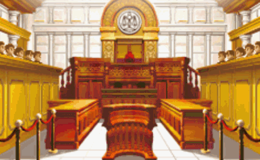

# PhoneixVideo

用于创建逆转裁判视频【后期可能完全实现其玩法】



# 目录结构

* p1：律师 | p2：检察官 | p3：法官

* sfx：音效 | bgm：背景音乐

* evidence：证据 | witness：证人

# 使用方法

需要安装Unity最低版本2020.2f.

> 在Drama.cs中的Play里有实例

关于Drama类：

```c#
p1(animation,loopcount);	// 显示律师
p2(animation,loopcount);	// 显示检察官
p3(animation,loopcount);	// 显示法官
```

* animation是目录结构中对应的文件名（不包含扩展名），含有(a)(b)的动画的loopcount只能为0，且传入参数时不写(a)(b)。
* loopcount：等待其动画播放至指定次数

```c#
noisy();	// 显示吵闹画面
```

```c#
say(name,words,[automatic]);	// 显示对话框
```

* name：对话人的名字
* words：对话内容
* [automatic]：是否自动执行下一个对话，默认为false。

```c#
sayAdd(words,[automatic])		// 追加对话框内容
```

* words：追加对话内容
* [automatic]：是否自动执行下一个对话，默认为false。

```c#
Objection1();	// 律师反对
Objection2();	// 检察官反对
```

```c#
shocks();		// 震惊画面
shockdone();	// 震惊结束
```

```c#
SoundPlayer.Play(filename);	// 播放音效
```

* filename：不包含扩展名

```c#
BGM(filename);				// 播放背景音乐
```

* filename：不包含扩展名

```c#
wit(name);		// 显示证人
evi(name);		// 显示证物
```

```c#
Delay(time);	// 等待指定时间（ms）
```

